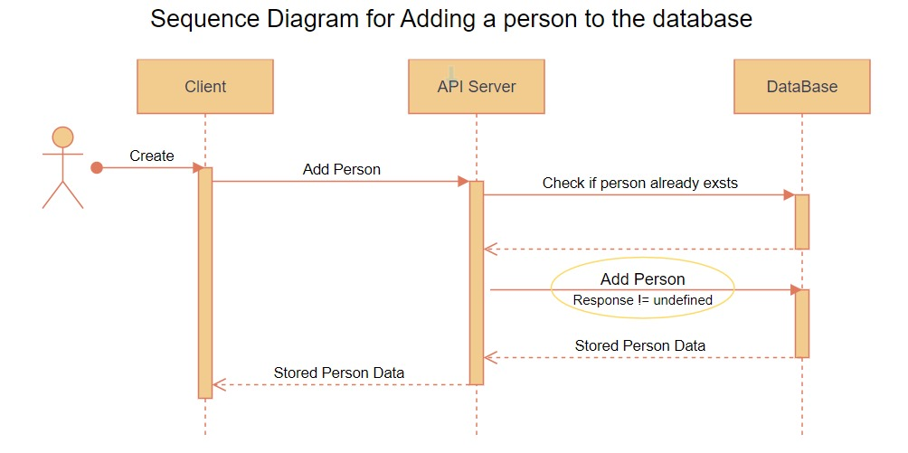
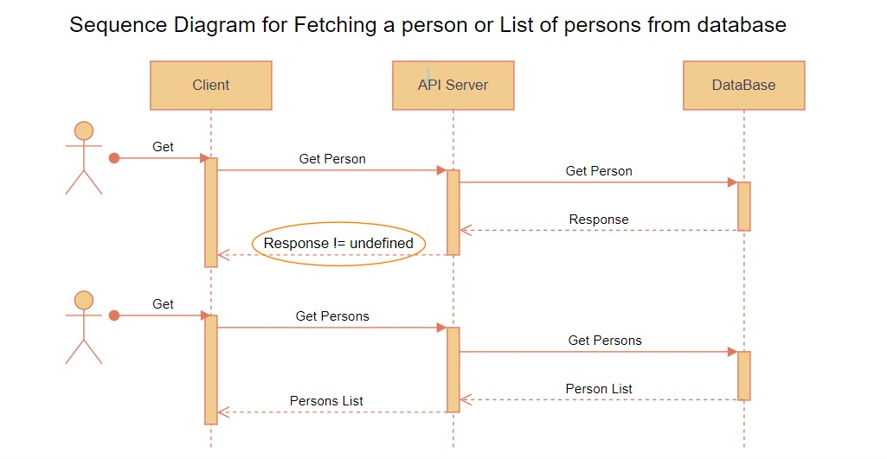
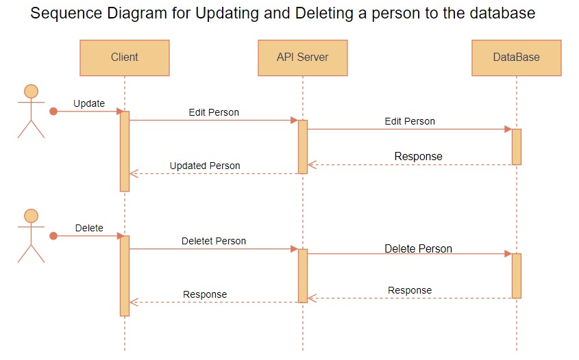

# Person API

This project is a backend API that's used to managed a person resource. this project is a task for stage two backend in the HNGX internship 2023.

It can be used to: 
- Store a person's personal information.
- Retreive a person's personal information.
- Update a person's personal information.
- Delete a person's personal information.

You can check out how to setup and use the API below

<br>

## Setup

<br>

- Get started, clone project from this [Github](https://github.com/chisomchris/hngx-be-t1) repository.

    ```sh
    git clone https://github.com/chisomchris/hngx-be-t1.git
    ```
- Navigate to project root. 
    ```sh
    cd hngx-be-t1
    ```
- Install project dependencies.
    ```sh
    npm install
    ```
- Create a `.env` file in the root folder
    
    ```sh
    touch .env
    ```

- Setup your mongoDB database and add connection string to **.env** file

    `.env`

    ```
    DATABASE_URI = connection-string-for-your-database
    ```

- Run your server locally
    
    ```sh
    npm run dev
    ```

- Make a `get` request to [localhost:3000/api](http://127.0.0.1:3000/api) to test server.

<br>

## Hosting Your API

<br>

You can host the project on any hosting platform of your choice e.g [railway](https://railway.app/), [cyclic](https://www.cyclic.sh/), [render](https://render.com/), ...

- Commit and push code to your github
- connect to repo from your hosting account, add Environments variable `DATABASE_URI= connection-string-for-your-database ` in your project hosting Environment varianles setup.
- Deploy project.

<br>

## UML Diagrams

<br>

#### Adding/Creating a new person record


<br>

#### Reading a person/persons record


<br>

#### Updating/Deleting a person record


<br>

## Endpoints Summary

<br>

| Endpoint | Method | Parameter | Data | Description |
| ------ | ------ | ------- | ------- | ------ | 
| [baseURL][1] | GET |  | | Retrieve all the person on the database |
| [baseURL][1] | POST |  | **name** : String (required), **about** : String (optional), **hobbies** : String (optional)   | Add person to the database if no pereson has same name, otherwise return error |
| [baseURL/][1]{name} | GET |  **name** : name of person| | Retrieve person on the database by his/her name|
| [baseURL/][1]{id} | GET | **id** : id of person || Retrieve the person by **id** |
| [baseURL/][1]{id} | PUT |  **id** : id of person |**name** : String (optional), **about** : String (optional), **hobbies** : String (optional)   | find person by **id** and update supplied information |
| [baseURL/][1]{name} | PUT |  **name** : name of person |**name** : String (optional), **about** : String (optional), **hobbies** : String (optional)   | find person by **name** and update supplied information |
| [baseURL/][1]{id} | DELETE | **id** - id of person || find person by **id** and delete. |
| [baseURL/][1]{name} | DELETE | **name** - name of person || find person by **name** and delete. |

<br>

## Details

<br>

### Endpoints

####  [baseURL][1] - GET

Use this endpoint to retreive all the persons in the data base, no data required.

#### Example usage

make a `get` request to [baseURL][1]

#### JSON Response

```sh
{
  "success": true,
  "result": [
                {
                    "id": "e982e23e3287a643b87f",
                    "name": "chisomchris",
                    "hobbies": "Loves bowling and hanging out with friends",
                    "about": ""
                },
                {
                    "id": "ac82e23e32873a643bed",
                    "name": "mark essien",
                    "hobbies": "Loves bowling and hanging out with friends",
                    "about": "Marketting expert"
                }, ...
            ]
  }
 ```
 
#### [baseURL][1]{name} -  GET 

Use this endpoint to retreive information of a single persons in the database, pass in the **name** of the person in the URI. No data required in the body.

#### Example usage

make a `get` request to [baseURL][1]chisomchris

#### JSON Response

```sh
{
  "success": true,
  "result": {
        "id": "e982e23e3287a643b87f",
        "name": "chisomchris",
        "hobbies": "",
        "about": "Loves bowling and hanging out with friends"
    }
  }
 ```
 
#### [baseURL][1]{id} -  GET 

Use this endpoint to retreive information of a single persons in the database, pass in the **id** of the person in the URI. No data required in the body.

#### Example usage

make a `get` request to [baseURL][1]e982e23e3287a643b87f

#### JSON Response

```sh
{
  "success": true,
  "result": {
        "id": "e982e23e3287a643b87f",
        "name": "chisomchris",
        "hobbies": "",
        "about": "Loves bowling and hanging out with friends"
    }
  }
 ```

#### [baseURL][1]{id} -  PUT 

Use this endpoint to update information of a single persons in the database, pass in the **id** of the person in the URI.

Pass the data you want to update in the body, at least one of **name** , **about**, and **hobbies** attribute is required, all field values must be a string.

#### Example usage

make a `put` request to [baseURL][1]e982e23e3287a643b87f

#### Request body 
```javascript
{
    "name": "Chisom Chris"
    "about": "chartered accountant, with an MSc",
    "hobbies": "listening to music"
}
```
#### JSON Response

```sh
{
  "success": true,
  "result": {
        "id": "e982e23e3287a643b87f",
        "name": "Chisom Chris",
        "hobbies": "listening to music",
        "about": "chartered accountant, with an MSc"
    }
}
 ```
 
#### [baseURL][1]{id} -  DELETE 

Use this endpoint to delete a person from the database, pass in the **id** of the person in the URI.

#### Example usage

make a `delete` request to [baseURL][1]e982e23e3287a643b87f

#### JSON Response

```sh
{
  "success": true,
  "result": {
        "id": "e982e23e3287a643b87f",
        "name": "chisomchris",
        "hobbies": "",
        "about": "Loves bowling and hanging out with friends"
    }
}
```
 
[1]: <https://chisomchris-hngx.onrender.com/api>
